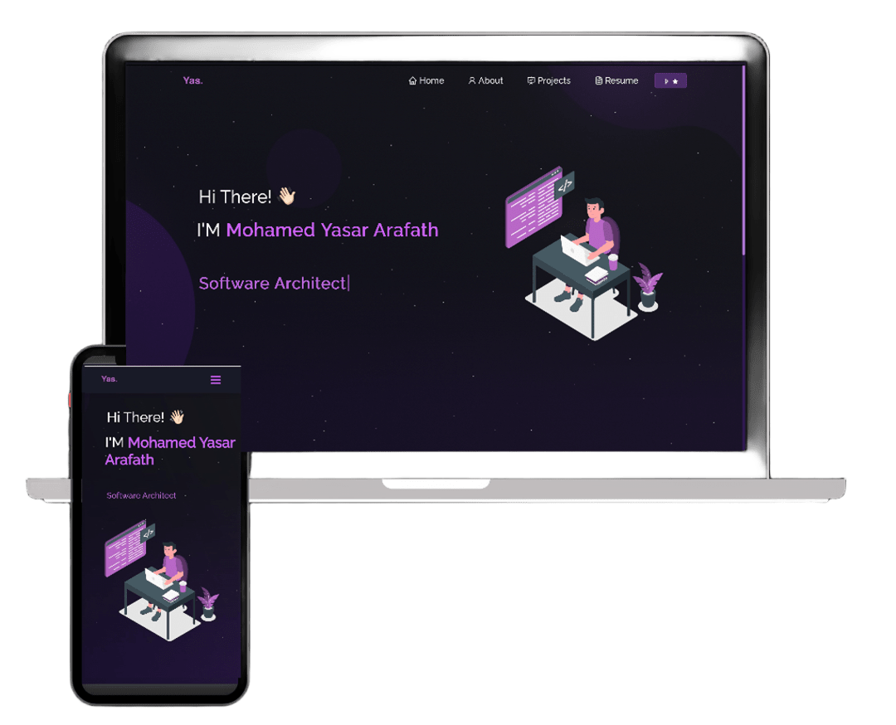

<<<<<<< HEAD
# My Portfolio Website 🌐

This repository contains the source code and assets for my personal portfolio website. The website serves as a platform to showcase my skills, projects, and professional journey in an engaging and interactive manner.

---

## 📋 Table of Contents
1. [Features](#features)
2. [Technologies Used](#technologies-used)
3. [Folder Structure](#folder-structure)
4. [Installation and Setup](#installation-and-setup)
5. [Live Preview](#live-preview)
6. [Contact Information](#contact-information)

---

## ✨ Features

- **Home Page**: Personal introduction and summary of expertise.
- **About Section**: Educational background, certifications, and achievements.
- **Projects Section**: Detailed information on completed projects.
- **Skills Section**: List of technical skills and tools.
- **Contact Section**: Easy access to email, GitHub, and LinkedIn profiles.

---

## 🛠️ Technologies Used

- **Frontend**: HTML,Bootstrap,CSS3,Jquery.
- **Deployment**: Static.app

=======
<h2 align="center">
  Portfolio Website - v2.0 
  <a href="https://soumyajit.vercel.app/" target="_blank">soumyajit.tech</a>
</h2>

  

 

 &nbsp;
 &nbsp;
 &nbsp;
 &nbsp;

<h3 align="center">
    🔹
    <a href="https://github.com/soumyajit4419/Portfolio/issues">Report Bug</a> &nbsp; &nbsp;
    🔹
    <a href="https://github.com/soumyajit4419/Portfolio/issues">Request Feature</a>
</h3>

## TL;DR

You can fork this repo to modify and make changes of your own. Please give me proper credit by linking back to [Soumyajit4419](https://github.com/soumyajit4419/Portfolio). Thanks!

## Built With

My personal portfolio <a href="https://soumyajit.vercel.app/" target="_blank">soumyajit.tech</a> which features some of my github projects as well as my resume and technical skills. 

This project was built using these technologies.

- React.js
- Node.js
- Express.js
- CSS3
- VsCode
- Vercel

## Features

**📖 Multi-Page Layout**

**🎨 Styled with React-Bootstrap and Css with easy to customize colors**

**📱 Fully Responsive**

## Getting Started

Clone down this repository. You will need `node.js` and `git` installed globally on your machine.

## 🛠 Installation and Setup Instructions

1. Installation: `npm install`

2. In the project directory, you can run: `npm start`

Runs the app in the development mode.\
Open [http://localhost:3000](http://localhost:3000) to view it in the browser.
The page will reload if you make edits.

## Usage Instructions

Open the project folder and Navigate to `/src/components/`.  
You will find all the components used and you can edit your information accordingly.

### Show your support

Give a ⭐ if you like this website!

>>>>>>> e03a53c (feat: replace existing portfolio with new React-based template and Firebase deployment)
